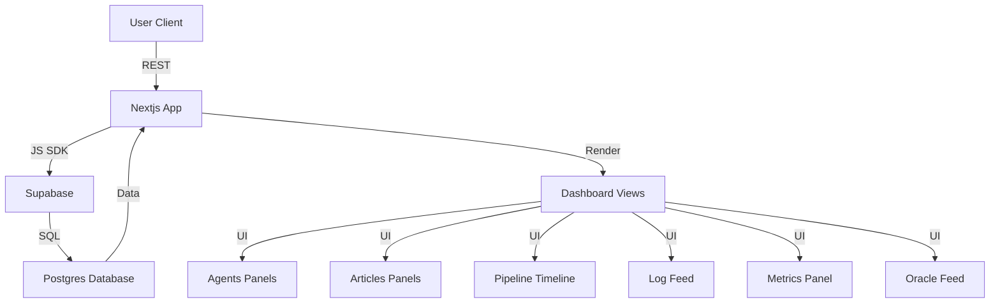

# The Pantheon
*An autonomous AI newsroom control panel for monitoring agents, articles, pipelines, logs, metrics, and oracle feeds in one Next.js dashboard.*


## Overview
The Pantheon is a Next.js App Router dashboard that acts like an “AI newsroom” ops console: it visualizes agents, articles, pipeline activity, and operational telemetry (logs, metrics, oracle feeds) in a single UI. It uses `@supabase/supabase-js` as the data layer and includes a `supabase/seed.sql` to quickly stand up realistic demo data. The UI is built as a reusable Radix + shadcn/ui-style component system (`components/ui`) with Tailwind CSS, plus `react-hook-form` + `zod` for robust form state and validation.

## System Architecture


## Tech Stack
| Category | Technologies |
|----------|-------------|
| Frontend |     |
| Database |  |
| Infra |  |

## Quick Start
Prerequisites: Node.js (TypeScript/Next.js 16), a Supabase project (Postgres), and environment variables for `@supabase/supabase-js`.

```bash
git clone https://github.com/shrikanthv15/the-pantheon.git
cd the-pantheon

npm install

# Seed your Supabase Postgres using the SQL in:
# supabase/seed.sql

# Set Supabase env vars (commonly NEXT_PUBLIC_SUPABASE_URL and NEXT_PUBLIC_SUPABASE_ANON_KEY)
# then run:
npm run dev
```

## Key Features
- **Newsroom-style ops dashboard**: dedicated views for agents, articles, pipeline activity, logs, metrics, and oracle feeds (e.g., `AgentCard`, `ArticleCard`, `PipelineLine`, `LogFeed`, `MetricsPanel`, `OracleFeed`).
- **Supabase-backed data layer with seedable demo state**: `lib/supabase.ts` integrates `@supabase/supabase-js`, and `supabase/seed.sql` bootstraps the database for fast local/demo setup.
- **Production-grade component system**: a large Radix-based UI kit under `components/ui` (shadcn/ui-style with `class-variance-authority`) keeps the dashboard consistent and composable.
- **First-class UX polish**: theming via `next-themes` (global provider composition in `app/providers.tsx`) and motion via `framer-motion`.
- **Type-safe forms and validation**: `react-hook-form` + `zod` patterns are wired for predictable client-side validation and ergonomics.